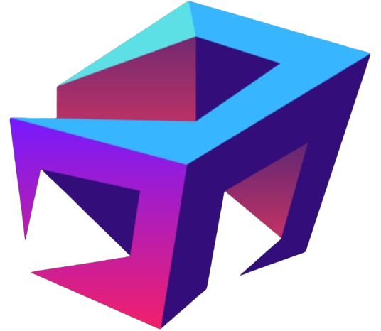

<div align="center">
  
  <h1>Do Hoang Vu — AI Engineer Portfolio</h1>
  <p>Polished, animated portfolio showcasing AI projects, research, and engineering craft.</p>
  
  <p><strong>Live Website:</strong> <a href="https://hoangvu.id.vn">hoangvu.id.vn</a></p>
  
  <p>
    <a href="https://nextjs.org"></a>
    
    
    
    
    
    
  </p>
</div>

---

## ⚙️ Tech Overview

-   **Framework**: Next.js 15 (App Router, React 19)
-   **Language**: TypeScript (strict typing across UI and data models)
-   **Styling**: Tailwind CSS with custom utilities and gradients
-   **Animation**: Framer Motion (page and component transitions)
-   **Icons**: react-icons (Feather icon set)
-   **Images**: Next/Image + optimized `ProjectImage` component
-   **Comments**: Giscus integration with custom dark theme styling
-   **AI Chatbot**: Real-time streaming chatbot.
-   **SEO**: Dynamic sitemap, robots.txt, Google Search Console verification
-   **Content**:
    -   Data-driven profile and projects in `src/data/profile.ts`
    -   Blog posts as Markdown in `src/data/blog/posts/*` with LaTeX/KaTeX support
    -   Interactive comment system with GitHub Discussions backend
    -   AI-powered chatbot for portfolio/blog assistance
-   **Build**: Next.js standalone output for containerized deployment
-   **Hosting**: Custom domain `hoangvu.id.vn` with Cloudflare tunnel

## 🗺️ Pages & Routes (App Router)

-   `/` — Home: hero, quick facts (education, certifications, languages), skills, featured projects
-   `/about` — About: background, education, interests, tech stack
-   `/projects` — Projects: filterable/searchable grid, featured and other projects, details CTA
-   `/projects/detail?project=<title>` — Project Detail: long description, features, challenges, results, tech list
-   `/blog` — Blog index: Markdown posts with math/KaTeX support, comment counts
-   `/blog/[slug]` — Blog article: server-rendered Markdown with syntax and math rendering, interactive comments
-   `/contact` — Contact links
-   `/resume` — Embedded PDF resume

## 🧩 UI Architecture

-   `src/components/layout/*`
    -   `MainLayout`: shared page chrome (navigation, footer, containers)
-   `src/components/ui/*`
    -   `ProjectImage`: optimized image with optional zoom and graceful fallback
    -   `dynamic-background`: animated background accents
    -   `typing-animation`: typed intro lines on the Home page
    -   `giscus-comments`: GitHub Discussions-powered comment system with custom dark theme
    -   `comment-count`: displays comment counts for blog posts
    -   `giscus-fallback`: graceful fallback UI when comments aren't configured
-   Motion patterns: section reveal, card entrance, subtle hover/tap feedback

## 🗂 Data Model

All profile and project content is centralized in `src/data/profile.ts` to keep the UI logic clean and reusable.

-   `profile.projects: Project[]`
    -   `title`, `type`, `description`, `details?`, `image?`, `thumbnail?`, `githubUrl?`, `demoUrl?`, `featured?`, `status?`, `techStack?`, `highlights?`
-   Project types and helpers live in `src/types/project.ts` (`BaseProject`, `hasDemo`, `hasGithub`, etc.)

## ✨ Key Features

-   **Data-driven projects** with strong typing and helpers (only render buttons when `demoUrl`/`githubUrl` exist)
-   **Project Detail builder**: derives long description, features, challenge/result narratives by title
-   **Responsive design**: grid layouts adapt across breakpoints, line clamping for summaries
-   **Rich visuals**: gradients, neon accents, glass-morphism cards, animated hero
-   **Markdown blog** with LaTeX/KaTeX math rendering (inline and display equations)
-   **Interactive comments**: GitHub Discussions-powered Giscus with custom portfolio-matched dark theme
-   **SEO optimized**: dynamic sitemap generation, robots.txt, Google Search Console integration
-   **Custom 404 page**: beautifully designed error page with navigation options
-   **Comment counts**: real-time comment statistics on blog index
-   **Deployment scripts**: Windows batch files for easy development and production deployment

## 🚀 Highlighted Projects

-   **SciHorizone — IELTS Exam Generator**
    -   Next.js + FastAPI + Google Gemini AI, PDF ingestion, automated grading, interactive exam UI
    -   Tech: Next.js, FastAPI, Python, TypeScript, Tailwind CSS, Docker
-   **Deeplearning-Practice**
    -   From-scratch implementations across CV/NLP/ML with clean documentation
    -   Tech: Python, PyTorch, Weights & Biases
-   **EzClip**
    -   Electron desktop app to download videos from multiple platforms using `yt-dlp`
    -   Tech: JavaScript, Electron, Node.js
-   **Decision Tree Visualization**
    -   Build/visualize decision trees from CSV with tunable parameters and metrics
    -   Tech: Python, FastAPI, scikit-learn, TailwindCSS
-   **PlugAgentX — Adaptive Plugin-Based LLM Agent Framework**
    -   Plugin system, context management, adaptive behavior; in development
    -   Tech: Python, LLM tooling
-   **Research & Competitions**
    -   SOICT24 paper on spatio-temporal attention + hierarchical fusion for video event retrieval
    -   ZALO AI Challenge 2023, AIC24 Competition (completed)

## 🖼️ Project Gallery Functionality

-   Featured projects appear first with hero imagery, badges, details list, tech stack chips, highlights
-   Filters: by category (AI & ML, Web App, Research) and by text search
-   Detail links route to `/projects/detail?project=...` where theme sections (Overview, Key Features, Challenges, Results, Technologies) are auto-assembled

## 📰 Blog Content

-   Markdown posts in `src/data/blog/posts/*`
-   Math support (inline and block) for technical writing with KaTeX
-   Posts are statically rendered with optimized HTML output
-   **Interactive comment system** with GitHub Discussions integration
-   Real-time comment counts displayed on blog index
-   Custom dark theme styling matching portfolio design
-   Emoji reactions and threaded discussions
-   SEO-optimized with automatic sitemap generation

## 📦 Structure

```
src/
  app/                 # Pages (App Router)
    blog/[slug]/       # Individual blog posts with comments
    sitemap.ts         # Dynamic sitemap generation
    not-found.tsx      # Custom 404 page
  components/
    layout/            # Layout primitives
    ui/                # Reusable UI widgets
      giscus-comments.tsx    # Comment system integration
      comment-count.tsx      # Comment count display
      giscus-fallback.tsx    # Fallback UI for comments
  data/
    blog/posts/        # Markdown articles
    profile.ts         # Centralized profile & projects
  lib/
    blog.ts           # Blog utilities with sitemap support
  styles/
    giscus.css        # Custom Giscus theme styling
  types/               # Shared TypeScript types & helpers
  utils/
    giscus-theme-injector.ts # Advanced Giscus styling
public/                # Static assets (images, pdf, etc.)
  robots.txt          # SEO crawler instructions
run/                  # Deployment and management scripts
  *.bat              # Windows batch files for automation
```

## ✍️ Extending Content

-   Add or update projects in `src/data/profile.ts` (`profile.projects`)
-   Provide hero/thumbnail images under `public/images/projects/<slug>/`
-   For blog posts, add a Markdown file to `src/data/blog/posts/`
-   Configure Giscus by setting `NEXT_PUBLIC_GISCUS_REPO_ID` and `NEXT_PUBLIC_GISCUS_CATEGORY_ID` in `.env.local`

## 🚀 Deployment & Hosting

-   **Live Site**: [hoangvu.id.vn](https://hoangvu.id.vn)
-   **Infrastructure**:
    -   Custom domain with Cloudflare tunnel for secure HTTPS
    -   Next.js standalone build for optimized containerized deployment
    -   Windows batch scripts in `/run` folder for easy management
-   **Development Scripts**:
    -   `run/start-web.bat` - Build and start production server with tunnel
    -   `run/start-web-no-build.bat` - Quick start without rebuilding
    -   `run/build-only.bat` - Build project only
    -   `run/portfolio-launcher.bat` - Interactive management menu
    -   `launch.bat` - Main entry point script

## 🔧 Setup & Configuration

1. **Clone repository**: `git clone <repo-url>`
2. **Install dependencies**: `npm install`
3. **Environment setup**: Create `.env.local` with Giscus configuration
4. **Development**: `npm run dev`
5. **Production**: Use scripts in `/run` folder or `npm run build && npm start`
6. **Comments**: Configure GitHub Discussions and add repo/category IDs to environment

## 📄 License

MIT
